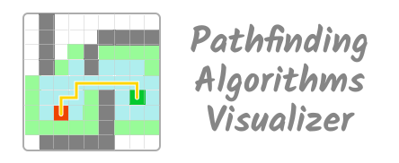

<div align="center">
    
</div>

<div align="center">


</div>

---

## 📘 Overview

This project is to demonstrate how different pathfinding algorithms work and identify the best and worst cases for each algorithm. This project is to learn those algorithms using a more visual approach.

## 🛠️ Installation Steps

1.  Clone the repository

```bash
git clone https://github.com/Yathu2007/React-Pathfinding-Visualizer.git
```

2.  Change the working directory

```bash
cd .\React-Pathfinding-Visualizer\
```

3.  Install dependencies

```bash
npm install
```

4.  Run the app

```bash
npm start
```

🌟 You are all set!

## 💻 Built with

-   [React JS](https://reactjs.org/)

-   [Tailwind CSS](https://tailwindcss.com/) - for CSS styling
