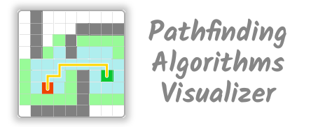

<div align="center">
    
</div>

<div align="center">


</div>

---

## Overview

This project is an interactive web application that visualizes how classic pathfinding algorithms explore a grid to find the shortest path between two points.

The goal of this project is to **build intuition** around algorithm behavior (exploration order, optimality, and performance) using step-by-step animations

## Pathfinding Algorithms

| Algorithm | Supports Weights | Optimal              | Notes                                                 |
| --------- | ---------------- | -------------------- | ----------------------------------------------------- |
| BFS       | ❌               | ✅ (unweighted only) | Explores level-by-level                               |
| DFS       | ❌               | ❌                   | Explores deeply, not guaranteed shortest path         |
| Dijkstra  | ✅               | ✅                   | Guarantees shortest path with non-negative weights    |
| A\*       | ✅               | ✅                   | Uses heuristic to guide search and reduce exploration |

> **Heuristic used for A\***: Manhattan distance  
> $\left( h(n) = |x_n - x_\text{goal}| + |y_n - y_\text{goal}| \right)$

> Mud cells introduce higher traversal costs, allowing Dijkstra and A\* to demonstrate meaningful differences compared to BFS/DFS.

## Features

-   **Configurable start and end nodes**
-   **Interactive barriers**
    -   Walls (infinite cost)
    -   Mud (higher traversal cost)
-   **Weighted grid support**
-   **Automatic path reconstruction**
-   **Step-by-step animated visualization**
-   **Light / Dark mode**

## Installation Steps

1.  Clone the repository

```bash
git clone https://github.com/Yathu2007/React-Pathfinding-Visualizer.git
```

2.  Change the working directory

```bash
cd .\React-Pathfinding-Visualizer\
```

3.  Install dependencies

```bash
npm install
```

4.  Start the development server

```bash
npm start
```

The app will be available at http://localhost:3000

## Built with

-   [React JS](https://reactjs.org/)

-   [Tailwind CSS](https://tailwindcss.com/)

-   Custom Priority Queue – for Dijkstra & A\*

-   [React Icons](https://github.com/react-icons/react-icons)
